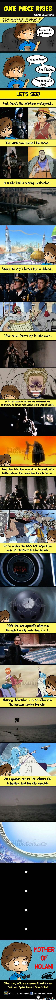

I recently came across [a thread](http://www.arlongpark.net/showthread.php?t=38320) stating the similarity between [One Piece (anime and manga)](https://en.wikipedia.org/wiki/One_Piece) by Eiichiro Oda and [The Dark Knight Rises movie](https://en.wikipedia.org/wiki/The_Dark_Knight_Rises) by Christopher Nolan.

### Textual Representation

| Incident | One Piece | The Dark Knight Rises |
| --- | --- | --- |
| Anti-hero protagonist | Luffy | Batman |
| Mastermind behind chaos | Crocodile | Bane |
| City that is nearing destruction | Alabasta | Gotham |
| City forces try to defend | Alabasta Royal Army | Gotham Police Force |
| Rebels try to take over | Koza and his army | All prisoners set free by Bane |
| Protagonist at the brink of death on first fight | Crocodile nearly impales Luffy and casts him into sand pit | Bane utterly breaks Batman and puts him in the pit |
| The next encounter is between the chaos | Luffy fights with Crocodile second time while rebels and royal army are fighting outside | Batman fights with Bane in midst of the fight between police and rebels |
| Protagonist has hidden a round shaped bomb somewhere in the city | Timed bomb hidden in the clock tower | Timed nuclear bomb hidden inside a moving truck |
| Protagonist's allies try to find the location of the bomb | Luffy's crew and Vivi | Gordon and his team |
| Bomb is airlifted far away from the city | Pel flies away carrying the bomb high into the sky | Batman uses the Bat to carry the bomb into the bay |
| **Extra** Both of them survive at the end | Pel is found alive in the subsequent episodes | Bruce Wayne is seen enjoying his vacation |

#### Holy mother of Nolan!
