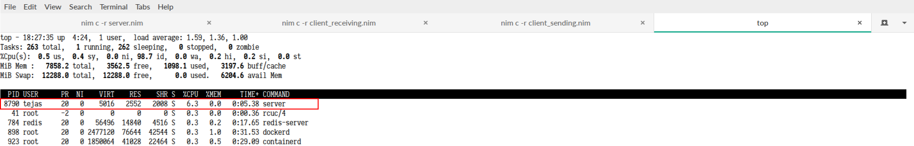
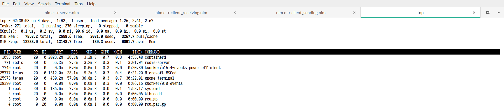

Build a simple chat server using nothing except sockets in Nim which pushes messages sent by any client to all other connected clients.

Since I'm at home now, on a break, not really doing anything, I decided to learn this new programming language called [Nim](https://nim-lang.org/) which is a perfect fusion between the elegance of Python and performance of C. What's better way to start with a language than actually creating something meaningful? So, I decided to not only create a simple chat server, but also write a step-by-step tutorial about it.

# Prerequisites

* Install Nim compiler. You can get the download links or installation commands from their [installation page](https://nim-lang.org/install.html). The compiler version in this tutorial is 0.18.0, though newer versions should not have any issue.
* Get Nim plugins for your editor. Again you can refer to the [editor plugins page](https://github.com/nim-lang/Nim/wiki/Editor-Support) on their [GitHub wiki](https://github.com/nim-lang/Nim/wiki/).

# Problem statement

> Our chat server will be a single room (channel) chat where anyone can talk with everyone. When a user types in a message, it is sent to all other users connected to the chat server.

In any chat application, the core responsibility of a server is just to act as a relay and send messages from one client to the other. The server should be sufficiently fast enough to accept newer clients who join, read messages from the clients, broadcast those messages to all other clients, without showing any noticeable delay for any of the clients. This would truly make it an instant messaging platform.

# I. Plan

We need a [full duplex](https://www.techopedia.com/definition/7154/full-duplex-fdx) link between the server and the client so that messages can be sent and received at the same time. Of all the various methods like [long-polling](https://realtimeapi.io/hub/http-long-polling/), [BOSH](https://en.wikipedia.org/wiki/BOSH_(protocol)), [comet](https://en.wikipedia.org/wiki/Comet_(programming)), my recommendation is to use [sockets](https://www.tutorialspoint.com/unix_sockets/what_is_socket.htm) ([web sockets](https://www.html5rocks.com/en/tutorials/websockets/basics/) for [browsers](https://caniuse.com/#feat=websockets)). They are truly bi-directional, light-weight and efficient for such use cases.

1. Our server would act as a socket server.
2. It would bind to a specific port and IP address and listen for new socket connections.
3. For every socket connected, it would add it to it's active socket connections list.
4. When any connected socket sends a message to the server, the server will send it to all the sockets in the active socket connections list (except the one who sent it).
5. If a connected socket closes connection, the server will remove it from the active list.

# II. Getting started

Create a directory in your projects folder (or wherever you want) called `simple-chat-server`. You might want to open this directory in your code editor. **All path references here on will be relative to this directory.**

Create a file called `server.nim`. This would be our core server file. To compile and run the code in this file, we will use `nim compile --run server.nim`.

We'll create a simple socket which will listen to new socket connections on port `5555` and then close it.

```nim{numberLines: true}:title=server.nim
import net

let server: Socket = newSocket()
server.bindAddr(Port(5555))
server.listen()
stdout.writeLine("Server: started. Listening to new connections on port 5555...")

server.close()
```

#### Explanation
> **1** All socket related functions, classes, utilities are in the [`net`](https://nim-lang.org/docs/net.html) package. We could have also used [`nativesockets`](https://nim-lang.org/docs/nativesockets.html) package which is exclusively for sockets. But it handles sockets at very low-level which might just lengthen our code.
>
> **3** Initialize our server socket using [`newSocket`](https://nim-lang.org/docs/net.html#newSocket,Domain,SockType,Protocol). This function also accepts some parameters which we will discuss in-depth later. For now, we are okay leaving it to the default values.
>
> **4-5** Set the socket to listen to new connections on port `5555` and start accepting new connections from other sockets. If [`address` parameter](https://nim-lang.org/docs/net.html#bindAddr,Socket,string) is not mentioned by default, the socket will listen to requests from all IP addresses.
>
> **8** Close our socket server. It is very important to close socket connections if they are no longer required. This is considered a clean way to end TCP connections with proper end-of-connection acknowledgement.

To run the above code, we need to compile it first and then execute the binary. Fortunately, the Nim compiler can do both in a single command by specifying the `--run` or `-r` argument.
The compiler pulls all the required packages along with `server.nim`, transpiles them into C, links the libraries and creates an executable binary file with the same name as our file sans the file extension (in our case it becomes `server`) in the root of the project directory.

```bash{outputLines: 2-24}
nim compile --run server.nim
Hint: used config file '/etc/nim.cfg' [Conf]
Hint: system [Processing]
Hint: server [Processing]
Hint: net [Processing]
Hint: nativesockets [Processing]
Hint: os [Processing]
Hint: strutils [Processing]
Hint: parseutils [Processing]
Hint: math [Processing]
Hint: algorithm [Processing]
Hint: times [Processing]
Hint: posix [Processing]
Hint: ospaths [Processing]
Hint: options [Processing]
Hint: typetraits [Processing]
Hint: sets [Processing]
Hint: hashes [Processing]
CC: server
CC: stdlib_system
CC: stdlib_net
Hint:  [Link]
Hint: operation successful (26847 lines compiled; 0.903 sec total; 47.43MiB peakmem; Debug Build) [SuccessX]
Hint: /home/tejas/Projects/simple-chat-server/server  [Exec]
```

The code ran but it didn't produce any output, except for compiler messages (we will be omitting compiler messages hereon). The server created the socket, listened for incoming connections and closed the socket connection.

Now we'll make the server wait until it receives new connections.

```nim{numberLines: true}:title=server.nim
import net

let server: Socket = newSocket()
server.bindAddr(Port(5555))
server.listen()
stdout.writeLine("Server: started. Listening to new connections on port 5555...")

var client: Socket = new(Socket)
server.accept(client)
stdout.writeLine("Server: client connected")

server.close()
```

```bash{outputLines: 2}
nim compile --run server.nim
Server: started. Listening to new connections on port 5555...
```

Our server is now actively listening for connections from clients. But… it's kinda stuck there because the server is waiting for a client to connect. We'll have to create one now.

Create a new file called `client.nim`. We'll use socket as a client and connect to the server.

```nim{numberLines: true}:title=client.nim
import net

let client: Socket = newSocket()
client.connect("127.0.0.1", Port(5555))
stdout.writeLine("Client: connected to server on address 127.0.0.1:5555")

client.close()
```

#### Explanation
> **3-4** Similar to the server, we need a socket object. The only difference here is, unlike server, which listens to connections, a client knows the server address and connects to it using the [`connect`](https://nim-lang.org/docs/net.html#connect,Socket,string) method. Thus, a client needs to have the address and port of the server.

Execute `server.nim` and at the same time, in a new terminal window/tab, execute `client.nim`.

```bash{outputLines: 2-3}
nim compile --run server.nim
Server: started. Listening to new connections on port 5555...
Server: client connected
```

```bash{outputLines: 2}
nim compile --run client.nim
Client: connected to server on address 127.0.0.1:5555
```

The server started and waited for connections. The moment we started the client, it connected to our socket server on the specified address. Server received this connection and assigned the client to the `client` variable, and closed the socket.

This was a barebones socket server and client. We have to add the real magic - sending and receiving messages.

# III. Sending and receiving messages

A socket on an OS is a file descriptor (layman: just a file). When we say that a socket received some data, it actually signifies that some data was written on that file descriptor.

We have built a server which accepts socket connection and a client which connects to the server. Now, we'll dive into the actual communication between client and server.

On the client side, we'll prompt user to enter the message to be sent and then send this message over to the server.

```nim{numberLines: true}:title=client.nim
import net

let client: Socket = newSocket()
client.connect("127.0.0.1", Port(5555))
stdout.writeLine("Client: connected to server on address 127.0.0.1:5555")

while true:
  stdout.write("> ")
  let message: string = stdin.readLine()
  client.send(message)

client.close()
```

##### Explanation
> **7** Once the user sends a message, we'll prompt for another message, sort of how chat applications provide a text box to send a message.
>
> **8-10** Prompt the user for a chat message and using the client socket, [`send`](https://nim-lang.org/docs/net.html#send,Socket,string) it to the server. Also, we are using [`readLine`](https://nim-lang.org/docs/system.html#readLine,File) so that the messsage gets stored only when user presses <kbd>Enter</kbd>.

On the server side, we need to listen to new messages from client. We'll also print the messages received from the client on the console.

```nim{numberLines: true}:title=server.nim
import net

var server: Socket = newSocket()
server.bindAddr(Port(5555))
server.listen()
stdout.writeLine("Server: started. Listening to new connections on port 5555...")

var client: Socket = new(Socket)
server.accept(client)
stdout.writeLine("Server: client connected")

while true:
  let message: string = client.recv(10)

  if message == "":
    break

  stdout.writeLine("Server: received from client: ", message)

server.close()
```

#### Explanation
> **12** Server will keep listening to new messages from all connected clients.
>
> **13** Read a few characters from the socket.
>
> **15-16** When a socket disconnects, it sends an empty string before disconnection. This can be used as an indication for the server that the client has disconnected. Since we are dealing with only one client, we'll stop receiving additional messages and exit the loop.
>
> **18** Print the received message on the console.

Let's execute both `server.nim` and `client.nim` in two different terminal tabs/windows. Note that I have used `nim c -r` which is a shorthand for `nim compile --run`.

```bash{outputLines: 2-5}
nim c -r client.nim
Client: connected to server on address 127.0.0.1:5555
> Hello, world
> Lorem ipsum dolor sit amet, consectetur adipiscing elit.
>
```

```bash{outputLines: 2-9}
nim c -r server.nim
Server: started. Listening to new connections on port 5555...
Server: client connected
Server: received from client: Hello, wor
Server: received from client: ldLorem ip
Server: received from client: sum dolor
Server: received from client: sit amet,
Server: received from client: consectetu
Server: received from client: r adipisci
```

Something's gone horribly wrong here. Not only our client messages are truncated, but they are also mingled with other messages. We sent _Hello, world_ and _Lorem ipsum dolor sit amet, consectetur adipiscing elit_. as two different messages, but on the server side we're getting them in sort of mingled fashion. Also, our second message is incomplete.

The culprit here is line 13. We specified that we'll only accept 10 characters from the socket. Also, until socket does not have at least 10 characters in its buffer, the [`recv`](https://nim-lang.org/docs/net.html#recv,Socket,int) function will keep blocking indefinitely. The socket will keep reading messages until it has reached that count in its buffer and only then it will return the data. We can do the following,

1. We'll use some delimiting character. We'll read a very small amount of data from the socket and scan all characters in it and store it in our own buffer. If we encounter the delimiting character while scanning, we'll stop there, dump whatever we read so far in the buffer and return the buffer data.
2. We can also use the `timeout` parameter in the [`recv`](https://nim-lang.org/docs/net.html#recv,Socket,int). By default, the timeout value is `-1`, which means we will wait indefinitely until there is enough data in the socket. We can set it to a small amount so that we don't wait indefinitely for new messages.

A much better solution here would be to use the [`recvLine`](https://nim-lang.org/docs/net.html#recvLine,Socket) method. It handles the complexity of handling the delimited character for us. It uses `\r\L` as the delimiter. This means, on the client side, for each message we send, we would also need to append this delimiter. Let's make the changes accordingly.

```nim{numberLines: true}:title=server.nim
import net

var server: Socket = newSocket()
server.bindAddr(Port(5555))
server.listen()
stdout.writeLine("Server: started. Listening to new connections on port 5555...")

var client: Socket = new(Socket)
server.accept(client)
stdout.writeLine("Server: client connected")

while true:
  let message: string = client.recvLine()

  if message == "":
    break

  stdout.writeLine("Server: received from client: ", message)

server.close()
```

```nim{numberLines: true}:title=client.nim
import net

let client: Socket = newSocket()
client.connect("127.0.0.1", Port(5555))
stdout.writeLine("Client: connected to server on address 127.0.0.1:5555")

while true:
  stdout.write("> ")
  let message: string = stdin.readLine()
  client.send(message & "\r\L")

client.close()
```

If the server and client are still running, kill the processes with <kbd>Ctrl</kbd>+<kbd>C</kbd>. Execute `server.nim` and `client.nim` again.

```bash{outputLines: 2-6}
nim c -r server.nim
server.nim(6)            server
net.nim(738)             bindAddr
oserr.nim(110)           raiseOSError
Error: unhandled exception: Address already in use [OSError]
Error: execution of an external program failed: '/home/tejas/Projects/simple-chat-server/server
```

If you're getting the above error, it's an indication that the port on which our server listens is being reserved for some reason. It happens when some process which is listening on that port is still running. Though in our case, even though we stopped the server, it's still giving us this error. The reason here is something called as _Linger Time_. When a socket is closed (especially TCP socket), some data which is marked to be sent, still exists in the socket's send buffer. Unless the buffer is emptied or a timeout period (usually 30 seconds) is passed, the system reserves the port.

To fix this, we use the `SO_REUSEADDR` property of sockets. If a socket is created with this option enabled, instead of throwing an error, it checks whether a socket which is listening on the same port is in lingering state. If it is, the socket will use the same address with an assumption that the earlier socket will release the port soon. In Nim, we have the `OptReuseAddr` option which can be set as `true` to enable `SO_REUSEADDR` property of the socket.

```nim{numberLines: true}:title=server.nim
import net

var server: Socket = newSocket()
server.setSockOpt(OptReuseAddr, true)
server.bindAddr(Port(5555))
server.listen()
stdout.writeLine("Server: started. Listening to new connections on port 5555...")

var client: Socket = new(Socket)
server.accept(client)
stdout.writeLine("Server: client connected")

while true:
  let message: string = client.recvLine()

  if message == "":
    break

  stdout.writeLine("Server: received from client: ", message)

server.close()
```

Let's run the server and clients again.

```bash{outputLines: 2-5}
nim c -r server.nim
Server: started. Listening to new connections on port 5555...
Server: client connected
Server: received from client: Hello, world
Server: received from client: Lorem ipsum dolor sit amet, consectetur adipiscing elit.

```

```bash{outputLines: 2-4}
nim c -r client.nim
Client: connected to server on address 127.0.0.1:5555
> Hello, world
> Lorem ipsum dolor sit amet, consectetur adipiscing elit.
>
```

As you can see now, the messages are no longer truncated and they are received in the same manner as sent by the client.

Now that we have spawned our basic server which accepts messages from a client, let's spawn another client and see what happens. Don't kill the currently running `server.nim` and `client.nim` and instead run `client.nim` again in a new tab/terminal and send a few messages.

```bash{outputLines: 2-5}
nim c -r client.nim
Client: connected to server on address 127.0.0.1:5555
> Hola, mundo
> What's 1 + 1? Answer is 10 in binary.
>
```

If you check the tab/terminal running our server, you wouldn't find these messages at all. The server did not receive any message at all from our new client. Can you identify the problem?

Notice the lines 9-11, where we wait and accept connection from a client. The moment a client connects, we never again accept and listen to data from new clients. As soon as we get a client, we just listen to new data from that client. What we can do is, as we listen to new data from one client, we'll also accept new connections from other clients. Our flow would go like this,

1. Have an infinte loop (`while true`) which will keep our server running.
2. Inside the loop, accept new client connections and add those into our client list.
3. For each client in the client list, check if there is any data.
4. If there is any data, print it out.

However, there is a slight problem in step 2. In our server socket, as seen here, the server will block the program flow while it is listening for new clients since `server.accept()` is a blocking function. Thus our messages will only be read once a client connects to the server. This is not even an acceptable case for our chat server.

Fortunately, sockets have an option to run in non-blocking mode. This means, our `accept()` and `recv()` functions will no longer block the code. If they have anything meaningful to return (like an incoming socket connection or a message), they will return that and continue execution. Otherwise, they will throw an error. Which means, we have to keep checking for new connections or messages and also handle the error in case we don't get any.

In Nim, we enable non-blocking mode using the [`setBlocking()`](https://nim-lang.org/docs/nativesockets.html#setBlocking,SocketHandle,bool) function of the underlying native socket. We'll also store all our connected sockets in a list so that we can iterate over them and receive messages from each of them. We'll do both, accept new connections and receive data from sockets in a single infinite loop, so that we keep accepting new connections while we receive messages from existing ones. Let's give this a try.

```nim{numberLines: true}:title=server.nim
import net
import nativesockets

var server: Socket = newSocket()
server.setSockOpt(OptReuseAddr, true)
server.getFd().setBlocking(false)
server.bindAddr(Port(5555))
server.listen()
stdout.writeLine("Server: started. Listening to new connections on port 5555...")

var clients: seq[Socket] = @[]

while true:
  try:
    var client: Socket = new(Socket)
    server.accept(client)
    clients.add(client)
    stdout.writeLine("Server: client connected")
  except OSError:
    discard

  var clientsToRemove: seq[int] = @[]

  for index, client in clients:
    try:
      let message: string = client.recvLine(timeout = 1)

      if message == "":
        clientsToRemove.add(index)

      stdout.writeLine("Server: received from client: ", message)
    except TimeoutError:
        discard

  for index in clientsToRemove:
    clients.del(index)
    stdout.writeLine("Server: client disconnected")

server.close()
```

#### Explanation
> **6** Set the socket as non-blocking. We set it on the low-level native socket API.
>
> **11** We need to store our connected clients in a list so that we can iterate over them to get messages.
>
> **13-37** Check if there are any existing connections. If yes, add them to the connected socket list. Then for each connected socket, check whether there are any messages to be read.
>
> **17** Add the connected socket in our clients list.
>
> **19** In non-blocking mode, [`accept`](https://nim-lang.org/docs/net.html#accept,Socket,Socket) throws an `OSError` if there are no pending connections at that moment. We ignore that exception because it's understandable that we won't have any pending connections all the time.
>
> **22** We maintain a list of clients which disconnected so that we remove those from our client list.
>
> **24** Iterate over all the connected clients and receive messages from them one by one.
>
> **26** We set the `timeout` to `1` since [`recvLine`](https://nim-lang.org/docs/net.html#recvLine,Socket) call still blocks the code as the default timeout value is `-1`, which means block indefinitely till message is received.
>
> **29** Mark the client for removal if it has disconnected.
>
> **32** If no message is received within the timeout period, [`recvLine`](https://nim-lang.org/docs/net.html#recvLine,Socket) throws a `TimeoutError`. Since we are operating in a non-blocking mode now, we shall ignore this error.
>
> **35-37** Remove any client marked for removal from the clients list.

Let's execute our server now with multiple clients.

```bash{outputLines: 2-11}
nim c -r server.nim
Server: started. Listening to new connections on port 5555...
Server: client connected
Server: client connected
Server: received from client: Hello
Server: received from client: Hola
Server: received from client: Foo
Server: received from client: Bar
Server: received from client:
Server: client disconnected

```

```bash{outputLines: 2-5}
nim c -r client.nim
Client: connected to server on address 127.0.0.1:5555
> Hello
> Foo
>
```

```bash{outputLines: 2-5}
nim c -r client.nim
Client: connected to server on address 127.0.0.1:5555
> Hola
> Bar
>
```

Yay! We have it now. Our server accepts and receives messages from multiple clients. We have also managed client disconnections. What our server should do now is send messages from one client to other clients, which a chat server should do. Let's do it.

There's a major catch here. Since sending and receiving messages is a simultaneous process, we would need some kinda GUI to handle these tasks asynchronously. Just think of it, suppose you are a client chatting on our server, you wouldn't receive any messages until you input a message because the `stdin.readLine()` will block all the code until the user hits <kbd>Enter</kbd>.

We can build a small GUI or use [`ncurses`](https://www.linuxjournal.com/content/getting-started-ncurses) to do that interactively in terminal. Since both of these are outside the scope of this tutorial, we'll make a hack for now. We'll create two different types of clients - one for sending messages and one for receiving. We call them `client_sending.nim` and `client_receiving.nim` respectively. `client_sending.nim` is exactly same as our `client.nim`.

```nim{numberLines: true}:title=client_sending.nim
import net

let client: Socket = newSocket()
client.connect("127.0.0.1", Port(5555))
stdout.writeLine("Client: connected to server on address 127.0.0.1:5555")

while true:
  stdout.write("> ")
  let message: string = stdin.readLine()
  client.send(message & "\r\L")

client.close()
```

```nim{numberLines: true}:title=client_receiving.nim
import net

let client: Socket = newSocket()
client.connect("127.0.0.1", Port(5555))
stdout.writeLine("Client: connected to server on address 127.0.0.1:5555")

while true:
  let receivedMessage: string = client.recvLine()
  stdout.writeLine("Message: ", receivedMessage)

client.close()
```

We would need some minor changes in our `server.nim`. Once the server receives a message, it will send it to all connected clients, except the one who sent the message.

```nim{numberLines: true}:title=server.nim
import net
import nativesockets

var server: Socket = newSocket()
server.setSockOpt(OptReuseAddr, true)
server.getFd().setBlocking(false)
server.bindAddr(Port(5555))
server.listen()
stdout.writeLine("Server: started. Listening to new connections on port 5555...")

var clients: seq[Socket] = @[]

while true:
  try:
    var client: Socket = new(Socket)
    server.accept(client)
    clients.add(client)
    stdout.writeLine("Server: client connected")
  except OSError:
    discard

  var clientsToRemove: seq[int] = @[]

  for index, client in clients:
    try:
      let message: string = client.recvLine(timeout = 1)

      if message == "":
        clientsToRemove.add(index)
        continue

      for receivingClient in clients:
        if receivingClient == client:
          continue

        receivingClient.send(message & "\r\L")

      stdout.writeLine("Server: received from client: ", message)
    except TimeoutError:
        discard

  for index in clientsToRemove:
    clients.del(index)
    stdout.writeLine("Server: client disconnected")

server.close()
```

Open three terminals - one for `server.nim`, one for `client_receiving.nim` and one for `client_sending.nim` - and execute the respective files. Try sending some messages from sending client and see if you get those in the receiving client.

```bash{outputLines: 2-7}
nim c -r server.nim
Server: started. Listening to new connections on port 5555...
Server: client connected
Server: client connected
Server: received from client: Hello
Server: received from client: How are you?
Server: received from client: What are you doing?
```

```bash{outputLines: 2-6}
nim c -r client_sending.nim
Client: connected to server on address 127.0.0.1:5555
> Hello
> How are you?
> What are you doing?
>
```

```bash{outputLines: 2-5}
nim c -r client_receiving.nim
Client: connected to server on address 127.0.0.1:5555
Message: Hello
Message: How are you?
Message: What are you doing?
```

You can open multiple terminals with `client_receiving.nim` and `client_sending.nim` and send messages to one another. You would observer that all receiving clients receive messages from all sending clients. This is because our server is current broadcasting all messages to everyone. We can limit this behavior, but we can skip that for now.

With this, you have completed a simple chat server with somewhat hacky clients (we'll fix that later). However, if you're working on a laptop, you would have noticed the noise of your CPU fan every time you run the server. If you're curious enough, check the output of `top` command and you'll notice that the server process is taking up some chunk of CPU.



It seems our code needs some fixing. Indeed it does. The way we are handling new connections and incoming messages on our server is very inefficient. We are persistently asking the socket for new connection and a new message, that too in an infinite loop. If socket was an actual person, it would mean as if we are pestering him every now and then for new information.

We have a solution for this. We'll make use of something that is core of lot of chat servers and surprisingly available on all platforms - [`select`](http://man7.org/linux/man-pages/man2/select.2.html).

# IV. Using `select` for optimization

Of all the amazing things that happened in Unix world, one was `select`. Originally appeared in BSD, `select` was quickly adopted in other popular OS. It's a kernel level utility which tells us which file descriptors are ready to be read, written or have an error condition. It does this using low-level file monitoring and interrupts, instead of iterating through all files and repeatedly checking if they have changed. This is cleaner, efficient and puts minimal load on our CPU.

## How to use `select` with our chat server?

Since all connected clients are nothing but file descriptors, we'll tell `select` to monitor these given file descriptors and notify us when there's any data on them that is yet to be read. Once `select` notifies us, it will give us a list of file descriptors which contain unread data. We'll iterate over these and see what data they have. Remember, when a socket receives data, it essentially means that it has data to be read.

`select` in Nim is a part of `selectors` package. It has two important methods of our concern - [`registerHandle`](https://nim-lang.org/docs/selectors.html#registerHandle,Selector[T],,set[Event],T) and [`select`](https://nim-lang.org/docs/selectors.html#select,Selector[T],int). `registerHandle` takes in a file descriptor, the events we want to listen to (read, write, error) and optional data that we wish to receive when the event is triggered. `select` takes in the timeout period until which it will wait for events on the registered handles (file descriptors). If we want `select` to block our code, we can set timeout as `-1`.

Let's dive into the code.

```nim{numberLines: true}:title=server.nim
import nativesockets
import os
import selectors

var server: Socket = newSocket()
var select: Selector[int] = newSelector[int]()
server.setSockOpt(OptReuseAddr, true)
server.getFd().setBlocking(false)
server.bindAddr(Port(5555))
server.listen()
stdout.writeLine("Server: started. Listening to new connections on port 5555...")

select.registerHandle(server.getFd(), {Event.Read}, -1)
var clients: seq[Socket] = @[]

while true:
  var results: seq[ReadyKey] = select.select(-1)

  for result in results:
    if Event.Read in result.events:
      if result.fd.SocketHandle == server.getFd():
        var client: Socket = new(Socket)
        server.accept(client)

        client.getFd().setBlocking(false)
        select.registerHandle(client.getFd(), {Event.Read}, -1)
        clients.add(client)
        stdout.writeLine("Server: client connected")
      else:
        var sourceClient: Socket = newSocket(result.fd.SocketHandle)
        var message = sourceClient.recvLine()

        if message == "":
          var clientsToRemove: seq[int] = @[]

          for index, client in clients:
            if client.getFd() == sourceClient.getFd():
              clientsToRemove.add(index)

          for index in clientsToRemove:
            var client: Socket = clients[index]
            select.unregister(result.fd)
            clients.del(index)
            stdout.writeLine("Server: client disconnected")
        else:
          stdout.writeLine("Server: received from client: ", message)

          for client in clients:
            if client.getFd() == sourceClient.getFd():
              continue

            client.send(message & "\r\L")

select.close()
server.close()
```

#### Explanation
> **2-3** Import the packages required for `select` functions. Note that we also imported `os` package. This is because, in Nim v0.18 and lower, `OSErrorCode` is not explicity imported in the `select` library. This is fixed in later versions.
>
> **6** We define our selector. It requires a type too. This would be the type of the data that we will associate in `registerHandle` method.
>
> **13** Register our server for read events. Note that read events on server socket would be incoming socket connections. Since we don't have any data associated with our server, we'll pass data as `-1`.
>
> **17** `select` returns a list of events along with their file descriptors for which the specified event was triggered.
>
> **20** We are only interested in read events.
>
> **21** The result received from `select` method contains the list of `events` that were captured and the file descriptor `fd` for which the event was triggered. Though our `fd` is enough, we compare the underlying socket for that file descriptor. If the one that triggered a read event was our server, it must mean that we recevied an incoming connection from a client.
>
> **25** Since clients are also handled by `select` we'll set them as non-blocking.
>
> **26** Just like our server, listen to read events of our client. Read event on a connected socket indicates that a new message has been arrived waiting to be read.
>
> **29** If the read event was not triggered by server, then it must be client. This means we received a message from a client which we have to broadcast to other clients.
>
> **30** Working with higher-level socket abstractions is easier. So, we convert our low-level socket from file descriptor in the result into a higher-level socket.
>
> **33-44** If a client is disconnected, remove it from clients list and [`unregister`](https://nim-lang.org/docs/selectors.html#unregister,Selector[T],) events for that client.
>
> **29** We could have compared the two objects directly. But since the newly created `sourceClient` object as a copy, it's identity would be different. This would cause an inequality even though the underlying sockets are same.
>
> **54** Like sockets, even select should be closed to signal the kernel that we are no longer listening to any events. This is a good practice to cleanly close everything before shutting down our program.

Let's run the program now and see our CPU usage.

```bash{outputLines: 2-7}
nim c -r server.nim
Server: started. Listening to new connections on port 5555...
Server: client connected
Server: client connected
Server: received from client: Hello
Server: received from client: How are you?
Server: received from client: select seems to be doing great
```

```bash{outputLines: 2-6}
nim c -r client_sending.nim
Client: connected to server on address 127.0.0.1:5555
> Hello
> How are you?
> select seems to be doing great
>
```

```bash{outputLines: 2-5}
nim c -r client_receiving.nim
Client: connected to server on address 127.0.0.1:5555
Message: Hello
Message: How are you?
Message: select seems to be doing great
```



It's not even showing in the top CPU consuming processes. That's great.

---

With this we complete our basic chat server. I know clients are still messy, but for that, we would need to dive deep into the interactivity part which is beyond the scope of this tutorial. Next up, we can add clients with identity information so that server can uniquely tag who sent which message, 1:1 messaging instead of group messaging and an interactive UI. I might write a follow-up article with all of these in future.

Nim is an amazing language. To be able to do so much, in so little and clean code is amazing. We haven't touched on code optimization yet, but I believe we can use some micro-optimizations to make this code even faster. It's been a great exercise for me to move away from Python and learn interesting languages like Nim.

Let me know about your feedback. If you feel there were any issues with the tutorial, or writing style, or any errors in text or code, or any difficulty in understanding, or if you just wanna give a compliment, leave your comments below.
